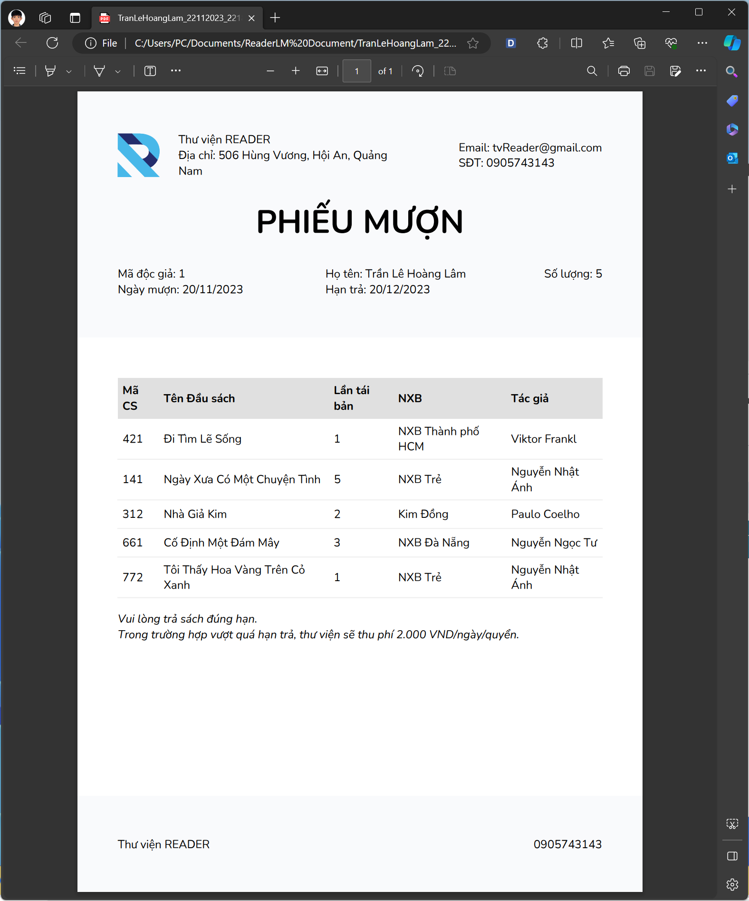
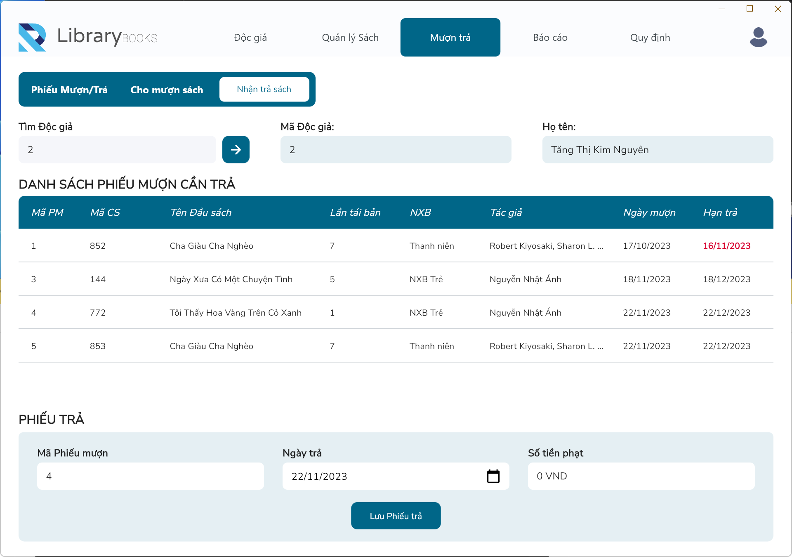

    
    

# Library Management

SE214.O11

## Reference

Flutter 3.13.1  
SQLite 3

### Screenshots

- Login

    

- Cho mượn sách

    

- Xuất file Phiếu mượn PDF

    

- Nhận trả sách

    

### Packages 
- sqflite_common_ffi: ^2.3.0+3
- bitsdojo_window: ^0.1.5
- flutter_localizations:
- flutter_bloc: ^8.1.3
- pdf: ^3.10.6 (to generate PDF file)
- path_provider: ^2.1.1